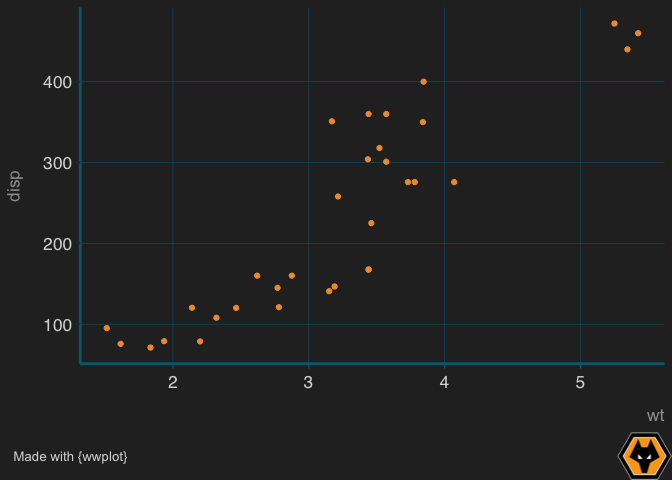
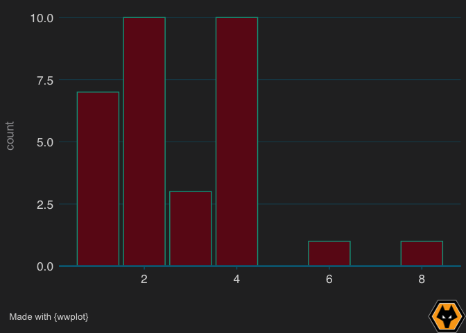

<!-- README.md is generated from README.Rmd. Please edit that file -->

# wwplot 

<!-- badges: start -->

<!-- badges: end -->

wwplot provides basic funtions for theming `ggplot2` graphics in the
style of Wolverhampton Wanderers football club (it makes sense given
that “We’re by far the greatest team the world has ever seen” 😉).

## Installation

You can install wwplot as follows:

``` r
devtools::install_github("lizardburns/wwplot")
```

## Example

This is a basic example which shows you how to apply the wolves theme
and how to brand the plot with a logo and source information:

``` r
library(magrittr)
library(wwplot)
library(ggplot2)
p <- mtcars %>% 
  ggplot(aes(x = wt, y = disp)) +
  geom_point(colour = wwfc_cols("light gold 20")) +
  wolves_theme(grid = "fullgrid")
brand_plot(p, add_source = TRUE)
```



``` r

q <- mtcars %>% 
  ggplot(aes(x = carb)) +
  geom_bar(
    fill = wwfc_cols("portugal red 20"),
    colour = wwfc_cols("mexico green 19")
    ) +
  wolves_theme() +
  scale_y_continuous(expand = expansion(mult = c(0,.05)))
brand_plot(q, add_source = TRUE)
```


